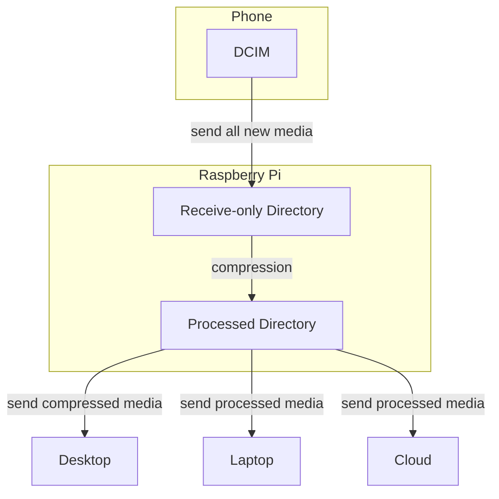

# Synchronisation chain

1. A piece of media gets recorded on the phone.
2. SyncThing sends it off to the receive-only server. 
3. The server detects the new file and processes it.
4. The server stores the processed file in a permanent storage.
5. (Optional) The permanent storage can send the processed files to other devices (such as my desktop and laptop).

