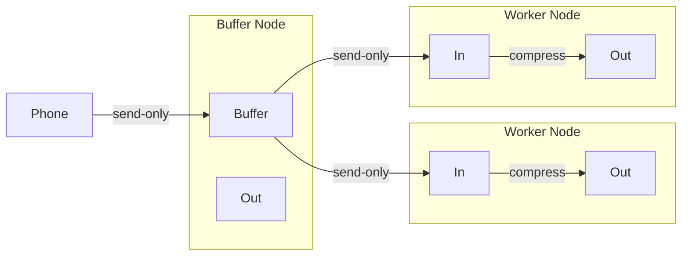
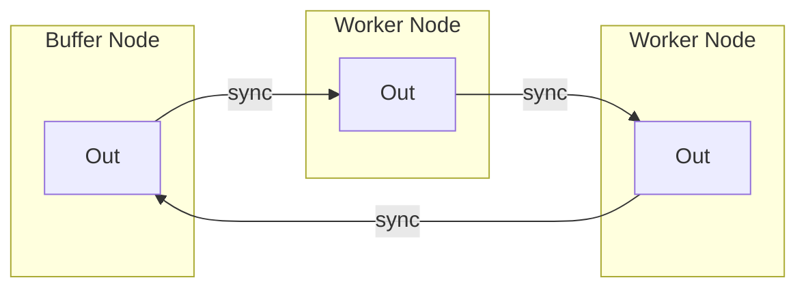

# Version 0.2

1. The phone records a piece of media and stores it in the DCIM directory.
2. SyncThing (Phone) sends the media to the receive-only buffer on the Raspberry Pi.
3. SyncThing (Raspberry Pi) sends the media to the worker nodes (Desktop and Laptop) for processing.
4. The worker nodes (Desktop and Laptop) process the media and store it in the output directory.
5. The processed media acts as a permanent storage and the contents should be synced among all the devices.

## Node Army
- `Buffer`: A receive-only directory on the Raspberry Pi that acts as a buffer so that the phone can always ship-off the media files.
- `In`: A receive-only directory on the *worker* nodes that receives the media files from the buffer.
- `Out`: A send-and-receive directory on *all* nodes where all compressed media files are stored and synced among *all* nodes.

## Permanent Storage
The `Out` directories act as a permanent storage for the compressed media files. The contents of the `Out` directories should be synced among all the nodes.

## Q&A

### 1. When to clear the receive-only buffer on the Raspberry Pi?
The buffer gets filled with media files from the phone. Overtime, files will accumulate in the buffer. Ideally, the buffer should *know* when a file has been processed by the worker nodes and then clear the file from the buffer. This suggests that there should be a way for the directories to signal each other and perform some kind of action.

**The proposed solution**: Every directory is operated by a piece of code. Every instance of the application acts as a node, and a node can run in different modes. All nodes have an `in` and `out` directory. All node periodically poll the `in` directory and act accordingly to their assigned    mode.

There are two modes:
- `buffer-mode`: The `in` directory in the buffer node is a receive-only directory that receives media files from the phone. 
    - On polling, the node checks its `out` directory and clears the media files that have been processed by the worker nodes.
- `worker-mode`: The `in` directory in the worker node is a receive-only directory that receives media files from a buffer node.
    - On polling, the node compresses all the media files in the `in` directory and stores them in the `out` directory. Handled files are cleared from the `in` directory.

The `out` directories are send-and-receive directories that store the compressed media files. All my processed files are thereby automatically stored on various devices, having multiple copies of the same file and ensuring that I never lose any data.

### 2. How to config and manage the SyncThing directories?
`config.xml` 
