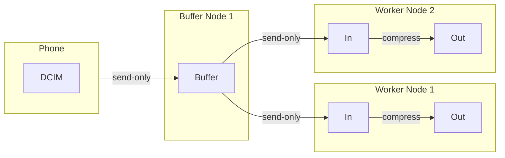
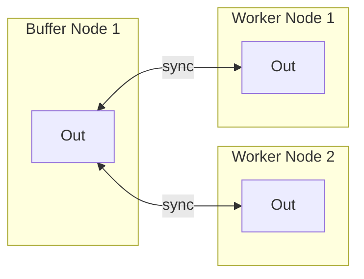

# Version 0.3

## Process Flow

## Permanent Storage 

## Initial Setup
:information_source: Here we assume the following:
1. The network consists of one buffer node and two worker nodes.
2. The `DCIM` directory of the phone is shared with the buffer node (send-only).
3. All the nodes have the media-vault software installed and running.
4. We have the IP addresses and API keys of all the nodes.

### Step 1: Adding Devices
First we add all the worker nodes to the device list of the buffer node.

### Step 2: Buffer-to-In
1. Create a directory named `Buffer` in the `in` directory of the buffer node.
2. Share the newly created `Buffer` directory with the worker nodes (send-only).
3. (???) Accept the shared directory on the worker nodes on the `in` directory.

### Step 3: Out-to-Out
1. Create a directory named `Out` in the `out` directory of the buffer node.
2. Share the newly created `Out` directory with the worker nodes (send-and-receive).
3. (???) Accept the shared directory on the worker nodes on the `out` directory.
